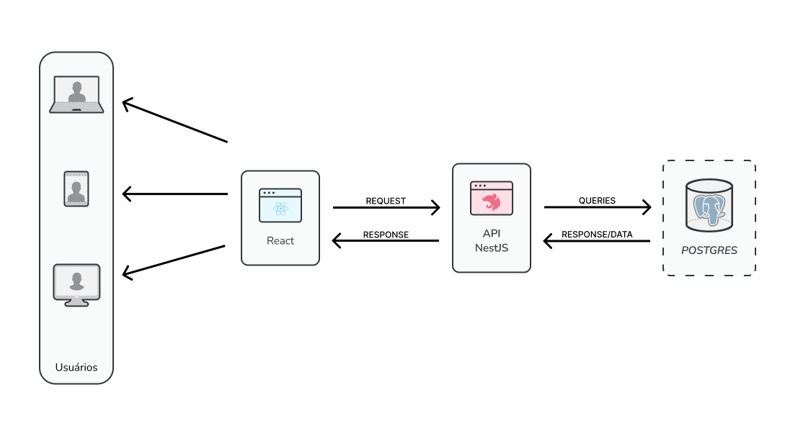
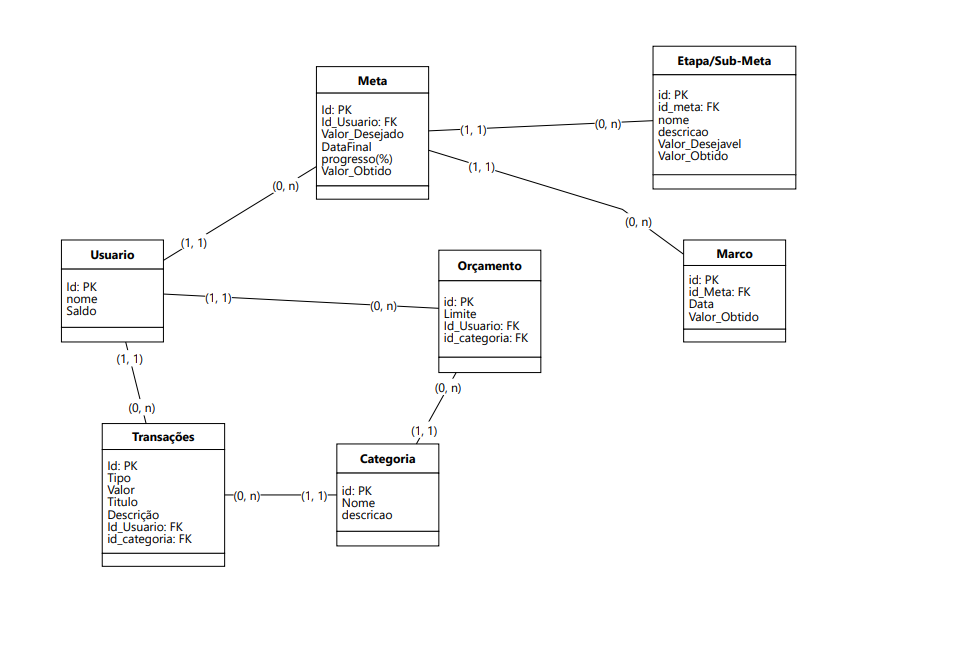

# **:sparkles:Repositório destinado á postagem de atividades/projetos da disciplina de Projeto Integrador II.:sparkles:**

- ## **Membros da equipe:**
    - <a href="https://github.com/Marcos1701">*Marcos Eduardo*</a>
    - <a href="https://github.com/MrMorgam">*Gabriel Morais*</a>
    - <a href="https://github.com/erick7amorim">*Erick Amorim*</a>
    

- ## **Ferramenta de Gerenciamento de Projeto utilizada:**

  - <a href="https://www.notion.so/e65c7907ef2a483581872dbf16c1074c?v=41dd9e9825c247e8a0fe487dc81a7c2c&pvs=4">**Notion**</a>
  - <a href="https://trello.com/b/rRJM6sxG">**Trello**</a>

## :heavy_check_mark: **. Tema Principal:**

 - ### :construction_worker: Área de atuação:
       Gestão Financeira Pessoal

 - ### :speech_balloon: Descrição do projeto:
       Trata-se de uma aplicação que permite aos usuários monitorar suas despesas, criar orçamentos e definir metas financeiras.
       Ela pode fornecer gráficos e análises para ajudar os usuários a tomar decisões informadas.

- ### :dizzy: Documento de Arquitetura:
  
  <a href="./Documentos_relacionados/Projeto_e_Prototipacao.md"> Tecnologias (Detalhes)</a>

- ### :space_invader: Diagrama de Dados (Lógico)

    

- ###  <a href="https://www.figma.com/file/S2YIduEFrUhXukCl5XWJbu/Wireframe_FinnApp?type=design&node-id=0%3A1&mode=design&t=OHh0hbuhagdd3TUU-1" >**Wireframe**</a>
  
 
